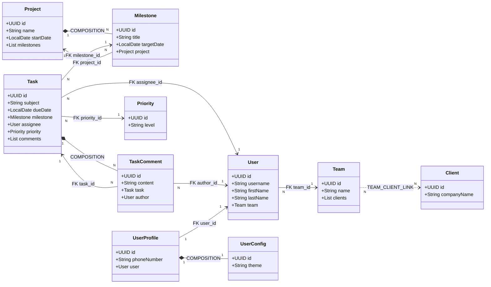
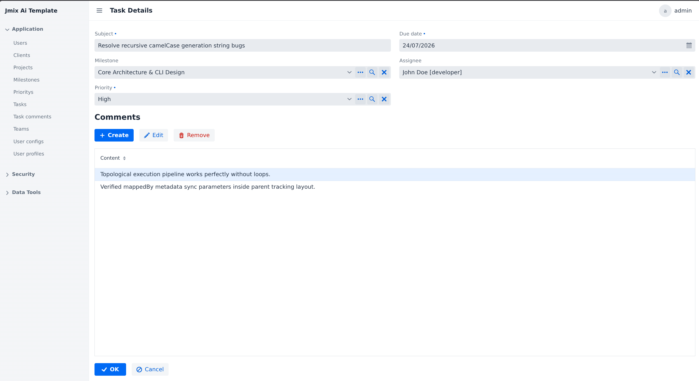

# Agile Project Management System

A Jmix 2.7.x-based full-stack application for managing agile projects with entities, relationships, and role-based access control.  
This application is a demo for how to use Jmix CLI Tool. 

## Architecture Overview 



## Domain Model

The system consists of 9 custom entities built on top of the standard Jmix `User` entity:

### Core Entities

| Entity | Description | Fields |
|--------|-------------|--------|
| **Project** | Root aggregate for project management | name, startDate (with versioning, audit, soft-delete) |
| **Milestone** | Project milestone with target date | title, targetDate |
| **Task** | Work item with assignee and priority | subject, dueDate, assignee, priority |
| **TaskComment** | Comments on tasks (composition) | content, author, task |
| **Priority** | Task priority levels | level |

### Organization Entities

| Entity | Description | Fields |
|--------|-------------|--------|
| **Team** | Development team | name |
| **Client** | Client organization | companyName |
| **User** | Extended from Jmix User | username, firstName, lastName, team (N:1) |
| **UserProfile** | User profile (1:1 with User) | phoneNumber, user |
| **UserConfig** | User preferences (composition with UserProfile) | theme, profile |

### Relationship Types

- **COMPOSITION (1:N, 1:1)**: Parent-child relationship where child lifecycle is tied to parent. Deleting parent cascades to children.
- **ASSOCIATION (N:1, N:N)**: Regular relationship without cascade delete.
- **MANY_TO_MANY**: Implemented via junction table with composite unique index.

## Configuration Files

### traits.csv - Entity Traits Configuration

Defines architectural properties for each entity:

| Column | Description |
|--------|-------------|
| `entity_name` | Entity class name |
| `versioned` | Enable optimistic locking via @Version |
| `audit_of_creation` | Add CreatedBy/CreatedDate fields |
| `audit_of_modification` | Add LastModifiedBy/LastModifiedDate fields |
| `soft_delete` | Enable soft delete via @DeletedBy/@DeletedDate |

### entities.csv - Entity Attributes Configuration

Defines custom business attributes for entities:

| Column | Description |
|--------|-------------|
| `entity_name` | Entity class name |
| `field_name` | Property name |
| `field_type` | Java type (String, Integer, LocalDate, etc.) |
| `mandatory` | NOT NULL constraint |
| `unique` | UNIQUE constraint |

### relations.csv - Entity Relationships Configuration

Defines relationships between entities:

| Column | Description |
|--------|-------------|
| `source_entity` | Source entity class name |
| `relation_type` | COMPOSITION_1:N, COMPOSITION_1:1, N:1, N:N |
| `target_entity` | Target entity class name |
| `field_name` | Field name in source entity |
| `mandatory` | NOT NULL constraint on FK column |

### roles.csv - Security Roles Configuration

Defines role-based access control:

| Column | Description |
|--------|-------------|
| `name` | Display name of the role |
| `code` | Unique role identifier |
| `entity_name` | Entity this role applies to |
| `ui_list` | Grant access to list view |
| `ui_detail` | Grant access to detail view |
| `create` | Grant CREATE permission |
| `read` | Grant READ permission |
| `update` | Grant UPDATE permission |
| `delete` | Grant DELETE permission |

## Jmix CLI Tool

`jmix-cli.py` is a parametric code generator that creates Jmix entities, views, Liquibase changelogs, messages, and security roles from CSV configuration files.

### Usage

```bash
# Generate ALL entities + Liquibase changelogs
python3 jmix-cli.py entity-all

# Generate single entity
python3 jmix-cli.py entity <EntityName>

# Generate ALL list views
python3 jmix-cli.py ui-list-all

# Generate ALL detail views
python3 jmix-cli.py ui-detail-all

# Generate single view
python3 jmix-cli.py ui-list <EntityName>
python3 jmix-cli.py ui-detail <EntityName>

# Generate security roles
python3 jmix-cli.py security

# Full generation (all phases)
python3 jmix-cli.py build-all
```

### Generated Artifacts

Running `build-all` creates:

1. **Entity classes** (`src/main/java/.../entity/`)
   - UUID primary key with `@JmixGeneratedValue`
   - `@Version` field for optimistic locking (if versioned=true)
   - Audit fields (`createdBy`, `createdDate`, `lastModifiedBy`, `lastModifiedDate`)
   - Soft delete fields (`deletedBy`, `deletedDate`) if soft_delete=true

2. **Liquibase changelogs** (`src/main/resources/.../liquibase/changelog/YYYY/MM/`)
   - Base changelog: `<timestamp>-01_base-<entity>.xml`
   - Relations changelog: `<timestamp>-02-relations_<entity>.xml`
   - FK constraints automatically added for COMPOSITION relationships

3. **Views** (`src/main/java/.../view/`)
   - List views extending `StandardListView`
   - Detail views extending `StandardDetailView`
   - DataGrid columns for all fields

4. **Messages** (`messages.properties`, `messages_ro.properties`)
   - Entity labels and field names
   - View titles and menu entries
   - For translate is used local `ollama` with model `translategemma:4b`, if was installed

5. **Security Roles** (`src/main/java/.../security/`)
   - `@ResourceRole` annotated classes
   - Entity policies (CRUD)
   - View policies (list/detail)
   - Menu policies for navigation

## Security Roles

| Role | Code | Permissions |
|------|------|-------------|
| **Project Manager** | project-manager | Full access to Project, Milestone, Team, Client; Read-only for Task (assigned), TaskComment, Priority |
| **Developer** | developer-role | Full access to Task, TaskComment; Read-only for Milestone, Priority; No User access |
| **Client Viewer** | client-viewer | Read-only access to Project, Task |

## Running the Application

```bash
# Clone the project in your computer
git clone https://github.com/florintanasa/agilepm
# Full generation (all phases)
python3 jmix-cli.py build-all
# Run application
./gradlew bootRun
# Access at http://localhost:8080 with admin/admin credentials
```

## Only to compile

```bash
./gradlew compileJava
```

## To clean your build

```bash
./gradlew clean
```

## Testing

```bash
./gradlew test
```

> [!WARNING]  
> If you have errors caused by Liquibase `liquibase.exception.DatabaseException: object name already exists: ` these mean you have an old database,
> and is necessary to delete the old files: `rm -rf .jmix/ build/ .gradle/`

## Demo data
In `listener` exist a class `AgileDemoDataIniTializer` this populate the data base with values at first run.  
To test the users roles we can use next credentials:
|User|Password|Roles|
|----|--------|-----|
|`manager`|1|ui-minimal, project-manager|
|`developer`|1|ui-minimal, developer-role|
|`client`|1|ui-minimal, client-viewer|

## CSV Configuration Tables

### traits.csv - Entity Traits Configuration

| entity_name | versioned | audit_of_creation | audit_of_modification | soft_delete |
|-------------|-----------|-----------------|---------------------|-------------|
| Project | true | true | true | true |
| Milestone | true | true | true | false |
| Task | true | true | true | true |
| TaskComment | true | false | false | false |
| Priority | true | false | false | false |
| UserProfile | true | true | true | false |
| UserConfig | true | false | false | false |
| Team | true | true | true | false |
| Client | true | true | true | true |

### entities.csv - Entity Attributes Configuration

| entity_name | field_name | field_type | mandatory | unique |
|-------------|------------|------------|-----------|--------|
| Project | name | String | true | true |
| Project | startDate | LocalDate | true | false |
| Milestone | title | String | true | false |
| Milestone | targetDate | LocalDate | false | false |
| Task | subject | String | true | false |
| Task | dueDate | LocalDate | true | false |
| TaskComment | content | String | true | false |
| Priority | level | String | true | true |
| UserProfile | phoneNumber | String | false | false |
| UserConfig | theme | String | true | false |
| Team | name | String | true | true |
| Client | companyName | String | true | true |

### relations.csv - Entity Relationships Configuration

| source_entity | relation_type | target_entity | field_name | mandatory |
|---------------|-------------|---------------|------------|-----------|
| Milestone | COMPOSITION_1:N | Project | milestones | true |
| Milestone | N:1 | Project | project | true |
| Task | N:1 | Milestone | milestone | false |
| TaskComment | COMPOSITION_1:N | Task | comments | false |
| TaskComment | N:1 | Task | task | true |
| Task | N:1 | User | assignee | false |
| Task | N:1 | Priority | priority | true |
| TaskComment | N:1 | User | author | true |
| User | N:1 | Team | team | false |
| UserProfile | 1:1 | User | user | true |
| UserConfig | COMPOSITION_1:1 | UserProfile | profile | true |
| Team | N:N | Client | clients | false |

### roles.csv - Security Roles Configuration

| name | code | entity_name | ui_list | ui_detail | create | read | update | delete |
|------|------|-------------|---------|-----------|--------|------|--------|--------|
| Project Manager | project-manager | Project | true | true | true | true | true | true |
| Project Manager | project-manager | Milestone | true | true | true | true | true | true |
| Project Manager | project-manager | Team | true | true | true | true | true | true |
| Project Manager | project-manager | Client | true | true | true | true | true | true |
| Project Manager | project-manager | Task | true | true | false | true | false | false |
| Project Manager | project-manager | TaskComment | true | false | false | true | false | false |
| Project Manager | project-manager | Priority | false | false | false | true | false | false |
| Developer Role | developer-role | Task | true | true | true | true | true | true |
| Developer Role | developer-role | TaskComment | true | true | true | true | true | true |
| Developer Role | developer-role | Milestone | true | false | false | true | false | false |
| Developer Role | developer-role | Priority | false | false | false | true | false | false |
| Developer Role | developer-role | User | false | false | false | true | false | false |
| Client Viewer | client-viewer | Project | true | false | false | true | false | false |
| Client Viewer | client-viewer | Task | true | false | false | true | false | false |

## Screenshoot

