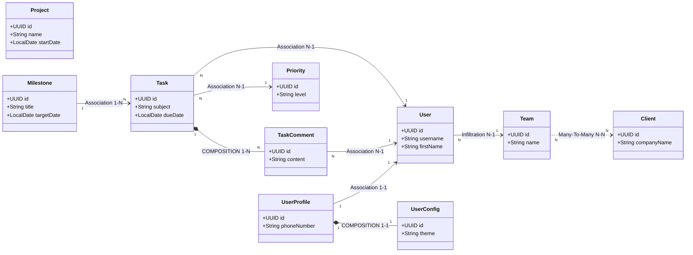

# Agile Project Management System

### 1. traits.csv (Jmix JPA Architecture Settings)

| entity_name | versioned | audit_of_creation | audit_of_modification | soft_delete |
| :--- | :--- | :--- | :--- | :--- |
| Project | true | true | true | true |
| Milestone | true | true | true | false |
| Task | true | true | true | true |
| TaskComment | true | true | false | false |
| Priority | true | false | false | false |
| UserProfile | true | true | true | false |
| UserConfig | true | false | false | false |
| Team | true | true | true | false |
| Client | true | true | true | true |

### 2. entities.csv (Custom Domain Business Attributes)

| entity_name | field_name | field_type | mandatory | unique |
| :--- | :--- | :--- | :--- | :--- |
| Project | name | String | true | true |
| Project | startDate | LocalDate | true | false |
| Milestone | title | String | true | false |
| Milestone | targetDate | LocalDate | false | false |
| Task | subject | String | true | false |
| Task | dueDate | LocalDate | true | false |
| TaskComment | content | String | true | false |
| Priority | level | String | true | true |
| UserProfile | phoneNumber | String | false | false |
| UserConfig | theme | String | true | false |
| Team | name | String | true | true |
| Client | companyName | String | true | true |

### 3. relations.csv (Structural Database Core Handshake)

| source_entity | relation_type | target_entity | field_name | mandatory |
| :--- | :--- | :--- | :--- | :--- |
| Milestone | COMPOSITION_1:N | Project | project | true |
| Task | N:1 | Milestone | milestone | false |
| Task | COMPOSITION_1:N | Task | comments | false |
| Task | N:1 | User | assignee | false |
| Task | N:1 | Priority | priority | true |
| TaskComment | N:1 | User | author | true |
| User | N:1 | Team | team | false |
| UserProfile | 1:1 | User | user | true |
| UserConfig | COMPOSITION_1:1 | UserProfile | profile | true |
| Team | N:N | Client | clients | false |

### 4. roles.csv (Granular Context Access Controls Matrix)

| name | code | entity_name | ui_list | ui_detail | create | read | update | delete |
| :--- | :--- | :--- | :--- | :--- | :--- | :--- | :--- | :--- |
| Project Manager | project-manager | Project | true | true | true | true | true | true |
| Project Manager | project-manager | Milestone | true | true | true | true | true | true |
| Project Manager | project-manager | Team | true | true | true | true | true | true |
| Project Manager | project-manager | Client | true | true | true | true | true | true |
| Project Manager | project-manager | Task | true | true | false | true | false | false |
| Project Manager | project-manager | TaskComment | true | false | false | true | false | false |
| Project Manager | project-manager | Priority | false | false | false | true | false | false |
| Developer Role | developer-role | Task | true | true | true | true | true | true |
| Developer Role | developer-role | TaskComment | true | true | true | true | true | true |
| Developer Role | developer-role | Milestone | true | false | false | true | false | false |
| Developer Role | developer-role | Priority | false | false | false | true | false | false |
| Developer Role | developer-role | User | false | false | false | true | false | false |
| Client Viewer | client-viewer | Project | true | false | false | true | false | false |
| Client Viewer | client-viewer | Task | true | false | false | true | false | false |
